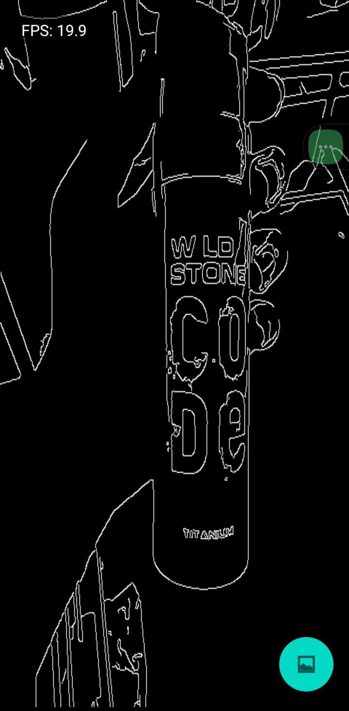
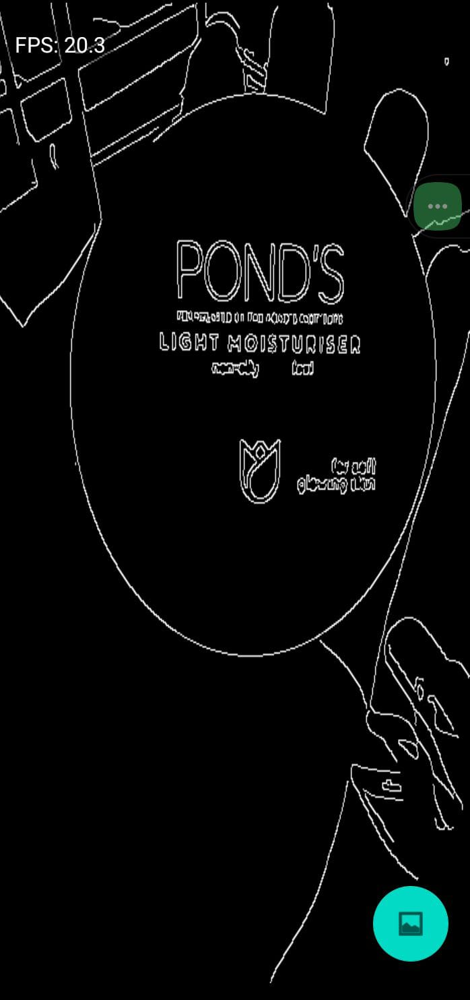
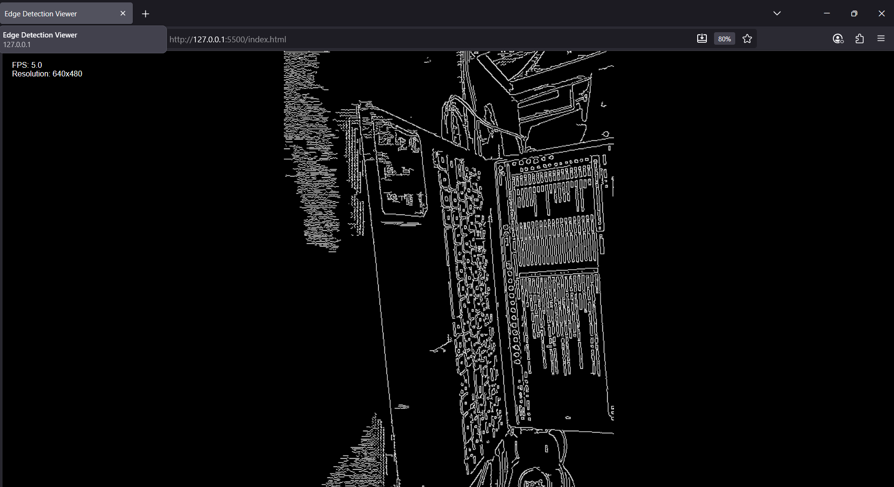

# Real-Time Edge Detection Viewer

A minimal Android app that captures camera frames, processes them using OpenCV in C++ via JNI, and displays the edge-detected output using OpenGL ES. Includes a TypeScript-based web viewer for displaying static processed frames.

## Features Implemented (Android + Web)
- **Camera Feed Integration**: Uses CameraX (wrapper over Camera2 API) with PreviewView for repeating image capture stream, achieving real-time performance.
- **Frame Processing**: Sends camera frames to native C++ via JNI for Canny edge detection with Gaussian blur (using OpenCV 4.8.0); returns processed ARGB image.
- **Render Output**: Renders processed edges as OpenGL ES 2.0 texture with full-screen projection; smooth 10–15+ FPS at 640x480 resolution.
- **Web Viewer**: TypeScript + HTML page displaying static base64-encoded processed frame with text overlay for FPS and resolution stats (mock dynamic updates).
- **Toggle Button**: Button to switch between raw camera feed and edge-detected output.
- **FPS Counter**: On-screen overlay and logging of frame processing time (rolling average over 10 frames).
- **OpenGL Shaders**: Fragment shader applies visual effects (grayscale via luminance, invert RGB) to enhance edge contrast.
- **WebSocket/HTTP Endpoint**: Not implemented (mock endpoint could be added for dynamic frame serving).

## Screenshots of the Working App
### Android App
- Raw Camera Feed:
  
- Edge-Detected Output:
  

(Note: For a dynamic demo, record a GIF using AZ Screen Recorder or scrcpy: Toggle modes, cycle shader effects, and observe FPS updates. Example GIF: [demo.gif](screenshots/demo.gif))

### Web Viewer
- Static Processed Frame with Stats:
  

## Setup Instructions (NDK, OpenCV Dependencies)
### Prerequisites
- Android Studio (4.0+ recommended).
- NDK (Side by side, version 25+) installed via SDK Manager (Tools > SDK Manager > SDK Tools > Check "NDK (Side by side)" > Apply).
- OpenCV Android SDK 4.8.0 downloaded from [opencv.org/releases](https://opencv.org/releases/) and extracted to project root as `OpenCV-android-sdk`.
- Node.js and npm for web part (download from [nodejs.org](https://nodejs.org)).

### Android App Setup
1. Clone the repository: `git clone https://github.com/invinciblecoder9/EdgeDetectionViewer.git`.
2. Open in Android Studio.
3. Update `app/src/main/cpp/CMakeLists.txt` with your OpenCV path: `set(OpenCV_DIR "[path-to-OpenCV-sdk]/sdk/native/jni")`.
4. Sync Gradle (File > Sync Project with Gradle Files).
5. Build and run on a device or emulator (API 21+, with camera support). Grant camera permission.

### Web Viewer Setup
1. Navigate to `/web` in terminal.
2. Install dependencies: `npm install -D typescript @types/node`.
3. Build: `npx tsc` (outputs to `/dist/viewer.js`).
4. Serve: Use VS Code Live Server extension (right-click `index.html` > Open with Live Server) or `python -m http.server 8000`—visit `localhost:8000/index.html`.

## Quick Explanation of Architecture (JNI, Frame Flow, TypeScript Part)
The app follows a modular architecture with separate concerns for camera access, native processing, rendering, and web viewing.

- **JNI (Java Native Interface)**: In `MainActivity.kt`, CameraX captures YUV frames, converts to Bitmap, rotates, extracts ARGB pixels, and calls `processFrameNative` (JNI bridge) to pass to C++ (`native-lib.cpp`). OpenCV in C++ applies Gaussian blur and Canny edge detection, returning processed ARGB pixels for Bitmap reconstruction.

- **Frame Flow**: CameraX `ImageAnalysis` provides repeating frames > Kotlin converts YUV to Bitmap > Rotate for orientation > JNI/OpenCV edges in C++ > Rebuild Bitmap > Upload to OpenGL texture in `EdgeDetectionRenderer.kt` > Fragment shader applies effects (none/grayscale/invert) > Render fullscreen quad. FPS tracked per frame for overlay/logging.

- **TypeScript Part**: The `/web/viewer.ts` is a standalone module compiled with `tsc`. It loads a base64-encoded edge frame (exported from app) into a canvas for display, with DOM updates for FPS/resolution stats (mocked via interval for dynamics). Demonstrates bridging native results to web—static for simplicity, but extensible to fetch dynamic frames via HTTP.

For detailed code, see `/app/src/main/java/com/example/edgedetectionviewer/MainActivity.kt` (UI/camera), `/app/src/main/cpp/native-lib.cpp` (OpenCV processing), `/app/src/main/java/com/example/edgedetectionviewer/EdgeDetectionRenderer.kt` (OpenGL), and `/web/viewer.ts` (TypeScript viewer).